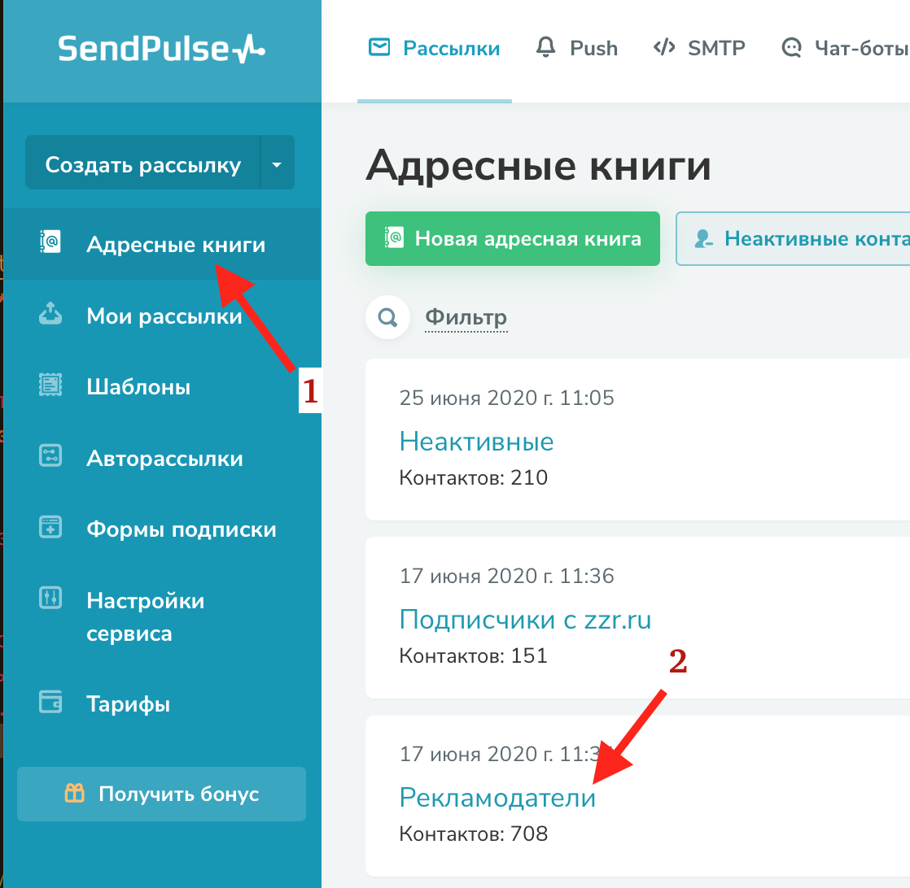

1. [Авторизуйтесь](../../auth) в рассылочном сервисе.

1. В меню слева выберите `Адресные книги`, затем кликните на адресную книгу, в которую хотите загрузить контакт.
   

1. Выберите вкладку "По одному" и заполните поля "Email" (обязательно) и, если требуется, другие необязательные поля. 
   

1. Нажмите кнопку "Загрузить".
