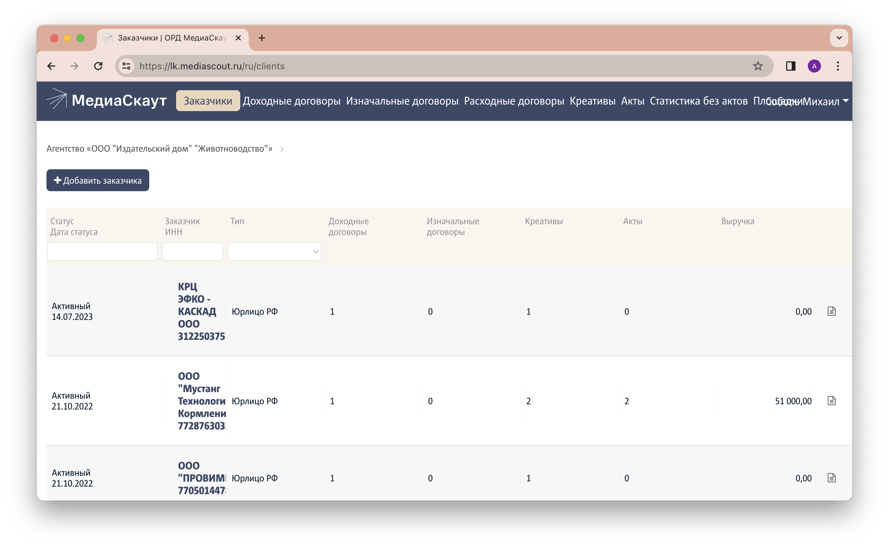
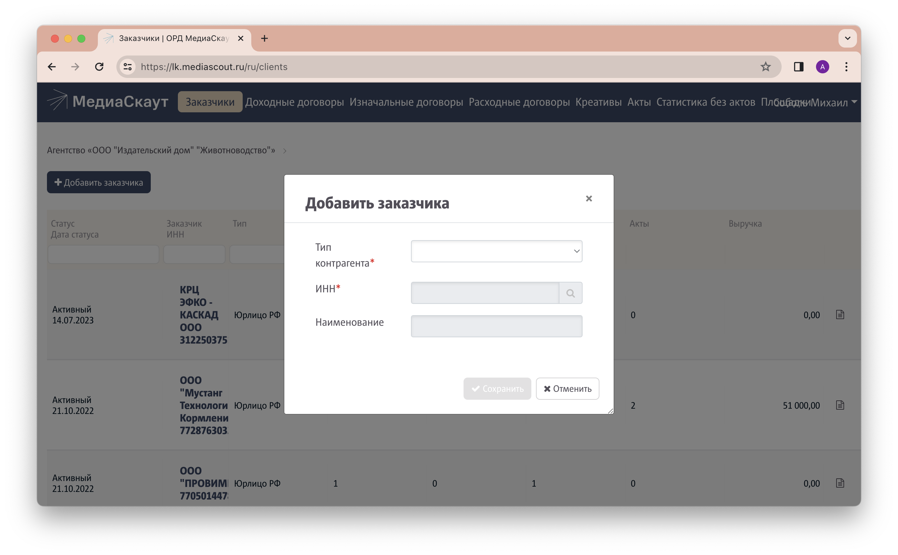

1. [Авторизуйтесь](../auth) в личном кабинете оператора рекламных данных.
1. Перейдите на вкладку "Заказчики".
1. Нажмите на кнопку `Добавить заказчика` вверху слева.
   
1. Заполните поля:
   - **Тип контрагента:** в 99% случаев это "Юрлицо РФ"
   - **ИНН:** вставьте ИНН компании и нажмите на значок "Лупа" справа от поля
   - **Наименование:** должно заполниться автоматически после нажатия на "Лупу". Если этого не произошло, _проверьте ИНН_. Если вы уверены, что ИНН верный, внесите наименование (название организации) вручную.
   
1. Нажмите кнопку `Сохранить`.

   
   Исправить название организации после сохранения можно только с помощью техподдержки ОРД. Если вы сохранили заказчика с неверным наименованием, обратитесь к техническому специалисту ИД для формирования заявки на замену.
    
1. Следующий этап  — [добавление договора](../add-contract).