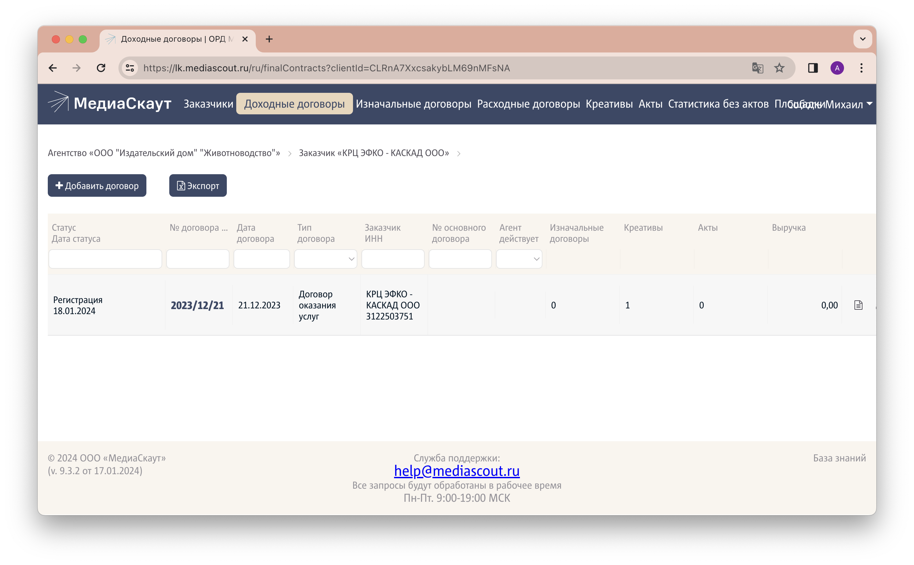
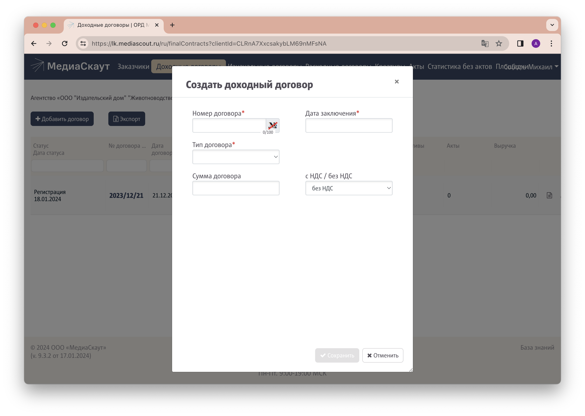

1. [Авторизуйтесь](../auth) в личном кабинете оператора рекламных данных, если не сделали этого ранее.
1. Перейдите на вкладку "Заказчики" и убедитесь, что организация, договор с которой вы собираетесь внести в систему, присутствует в списке. При необходимости можно воспользоваться поиском по полю "ИНН/Заказчик". Если заказчика нет, его необходимо [добавить в систему ОРД](../add-client).
1. Кликните на необходимом заказчике - произойдет переход на вкладку "Доходные договоры".
1. Нажмите на кнопку `Добавить договор` слева вверху.
   

   
   Перед добавлением дополнительного соглашения сначала добавьте основной договор с рекламодателем, руководствуясь текущей инструкцией. 
    

1. Заполните поля:
   - **Номер договора:** введите номер договора, подписанного рекламодателем
   - **Дата заключения**
   - **Тип договора:** выберите "Договор оказания услуг", если это основной договор с рекламодателем и "Дополнительное соглашение" в случае добавления допсоглашения. При добавлении допсоглашения появится дополнительное поле "Основной договор", в котором нужно выбрать ранее внесенный в систему договор с рекламодателем.
   
1. Нажмите кнопку `Сохранить`.
1. Следующий этап  — [добавление креатива](../add-creative).
