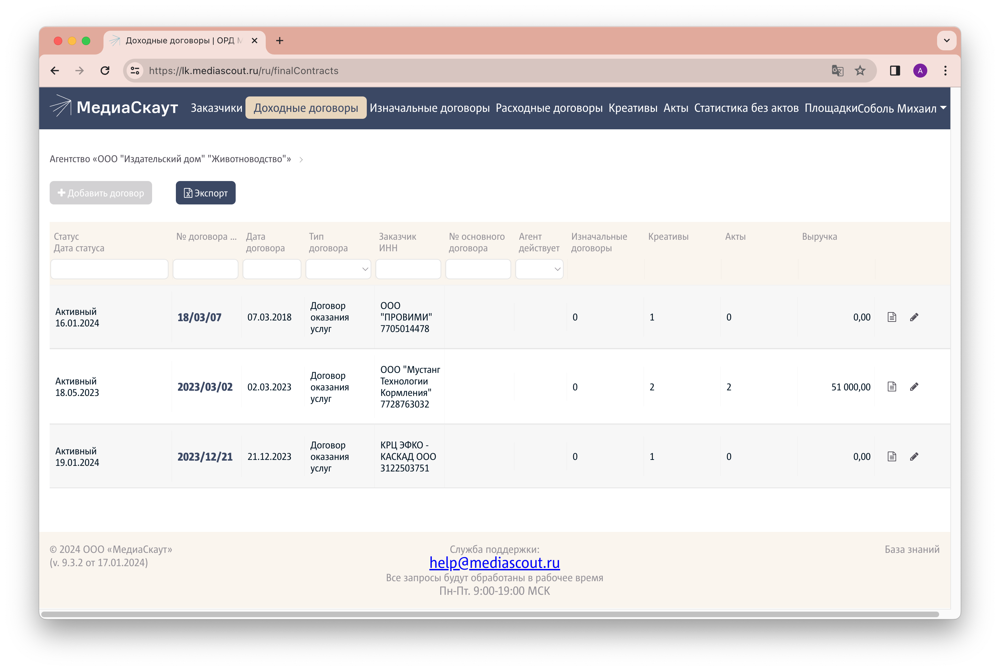
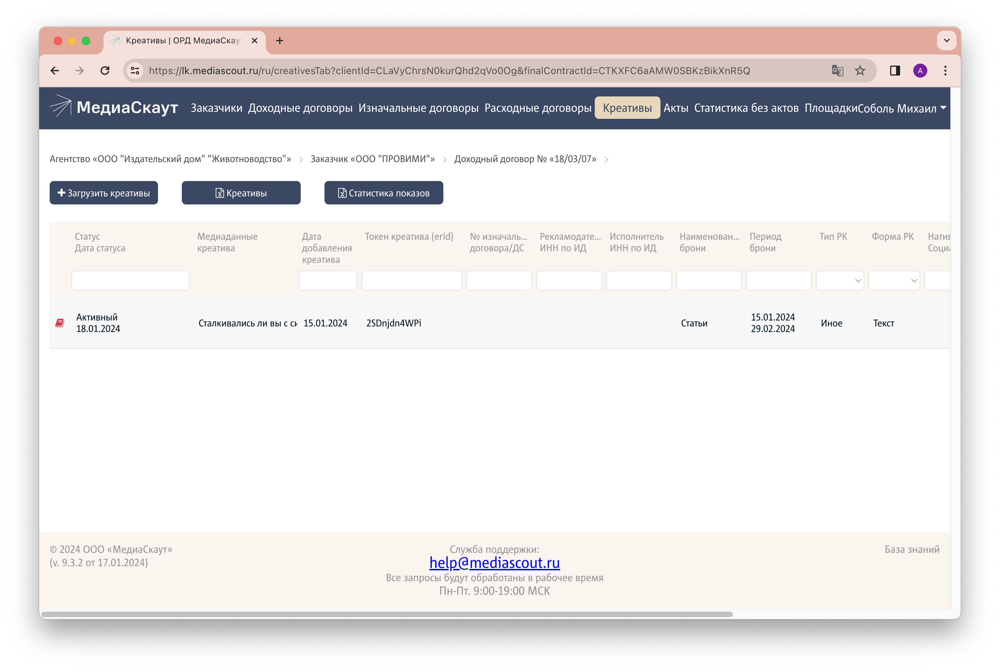
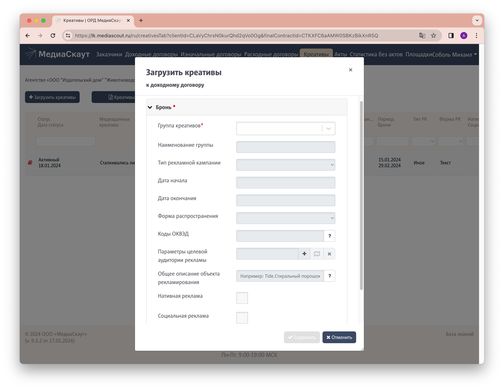
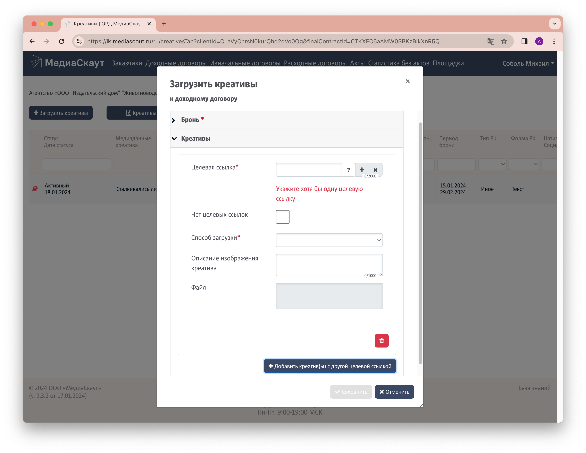
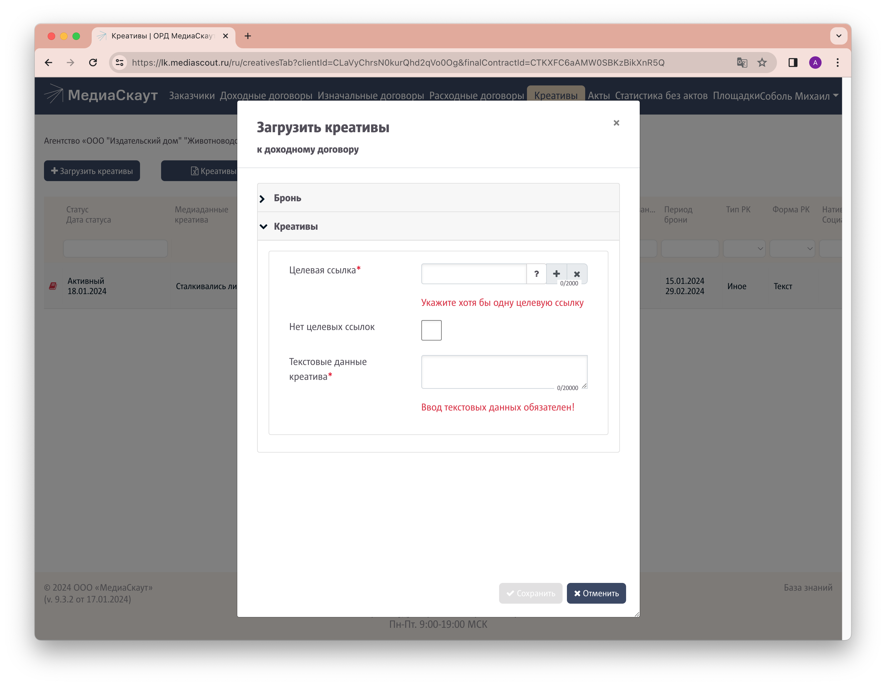
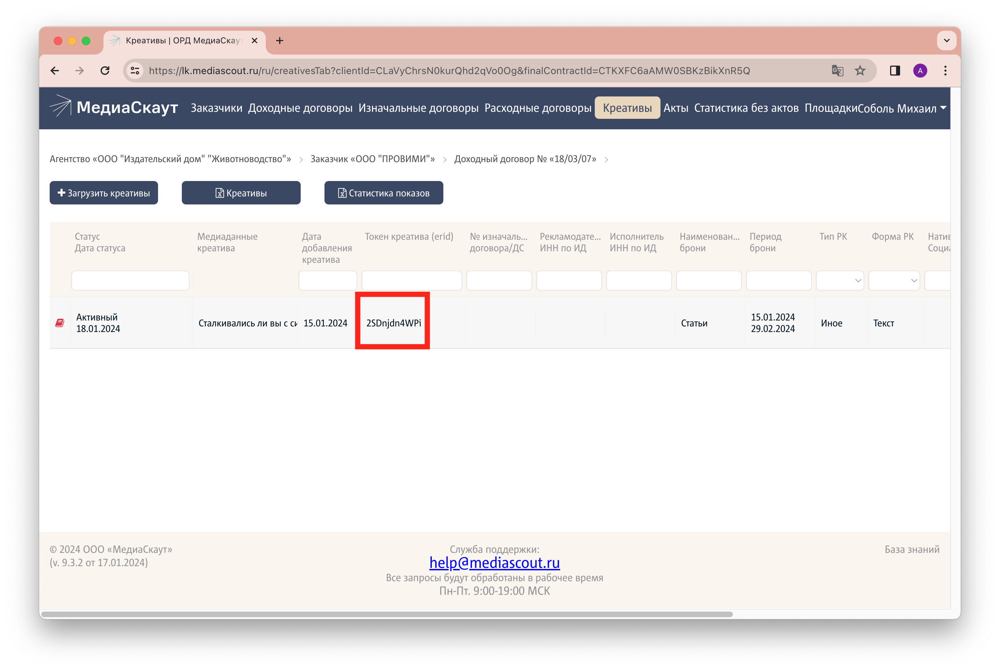


**"Креатив"** - элемент (баннер, статья, интеграция в блогах и т.п.), который показывается пользователям в приложении, на сайте или любом другом ресурсе. В ИД основными видами креативов являются **баннеры** и **статьи.**

Креатив прикрепляется к договору или допсоглашению о размещении рекламной информации на сайте.
 

1. [Авторизуйтесь](../auth) в личном кабинете оператора рекламных данных, если не сделали этого ранее.
1. Перейдите на вкладку "Доходные договоры" и убедитесь, что договор, по которому размещается креатив, присутствует в списке. При необходимости можно воспользоваться поиском по полю "№ договора / ДС". Если договора нет, его необходимо [добавить в систему ОРД](../add-contract).
   
1. Кликните на необходимом договоре, затем на вкладке "Креативы".
1. Нажмите на кнопку `Загрузить креативы` слева вверху.
   
1. В разделе "Бронь" заполните поля:
   - **Группа креативов:** выберите "Новая группа креативов"
   - **Наименование группы:** укажите "Баннеры" или "Статьи" в зависимости от типа добавляемого креатива. Если к договору прикрепляется несколько статей или баннеров, то необходимости заполнять поле "Наименование группы" каждый раз нет. Заполните его один раз для первого баннера или первой статьи, а для последующих креативов того же типа выберите группу в поле "Группа креативов"
   - **Тип рекламной кампании:** выберите "Иное"
   - **Форма распространения:** выберите "Баннер" или "Текст" в зависимости от типа добавляемого креатива
   - **Общее описание объекта рекламирования:** укажите бренд рекламируемого товара или услуги и его краткое описание. Например, "Efkofeed Pro Оptimum. Шрот с подсолнечным и соевым защищенным белком"
   
1. Перейдите в раздел "Креативы" и заполните его в соответствии с типом креатива:  
   
   **Для баннеров**  
   - **Целевая ссылка:** ссылка _на сайт рекламодателя_ (не на zzr.ru)
   - **Способ загрузки:** выберите "Загрузка креатива из одного файла"
   - **Файл:** выберите файл с баннером на вашем компьютере
   
   **Для статей**  
   - **Целевая ссылка:** если в статье присутствует ссылка _на сайт рекламодателя_, укажите ее. В противном случае отметьте пункт "Нет целевых ссылок" ниже
   - **Текстовые данные креатива:** вставьте текст статьи, только название + содержание
   
1. Нажмите кнопку `Сохранить`
1. Скопируйте ERID-токен из таблицы для его дальнейшего размещения на сайте.
   